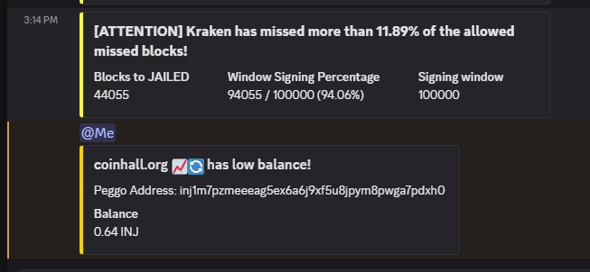

# All-in-one validator services bot for Injective & other Cosmos-SDK based blockchains

The bot supports the following alerts:
- Missed blocks (signing performance)
- Validator status (active/inactive/jailed)
- Governance proposals
- Peggo performance (Injective)
- Balance checks (Injective/Ethereum)
- IBC packets/client tracking
- Consensus state
- Network upgrades (planned)

The bot supports 3 platforms: Slack, Discord and Telegram. Injective Telegram users can use the bot directly: `@cosmos_aio_bot`. For local deployment, referring to [`app/README.md`](app/README.md).




## Configuration
The configuration file is used to set up the AIO Bot for various platforms. It also contains subscription details to receive alerts on each platform, ensure the file is valid and present.

Below is an explanation of each section:
#### `app`
This section configures the platforms (Slack, Discord, Telegram) where the bot will send alerts. Besides the credentials required for each platform's setup, each platform also has separated configurations of mode and channels to send messages to.

**Parameters**:
- `enable`: Toggle to enable or disable the alerting functionality for a specific platform.
- `mode`: Operation mode in each platform: `single` and `chain`. When the bot operates in `single` mode, it tracks a single validator only, which is helpful for single user, while in `chain` modes, the bot track chain's multiple addresses and features, which is suitable for the community. `single` mode works only in Slack/Telegram, while Discord supports both `single` and `chain` mode.
- `channels`: List of channels with `id` and `name`. It is recommended to use different channels for specific feature, especially for local deployments.
- `subscriptions`: List of user subscriptions for alerts. These users will be tagged in the messages they subscribe to.

#### `chain`
Specifies the blockchain the bot is monitoring. Example: `Injective`.

#### `rpcs`, `api`
Lists of RPC and API endpoints of the chain, set multiple endpoints for redundancy.

#### `jsonrpc`
JSON-RPC endpoint for the blockchain, for EVM querying (depend on chains)

#### `features`
This section enables or disables specific bot features and configures their parameters.

- `enable`: Boolean to enable/disable the feature.
- `params`: Parameters of each feature.

> Note: `validator` feature has different parameters for each mode. In `single` mode, the bot checks validator's sign in every block and notifies user after `threshold`, while in `chain` mode, the bot periodically checks signing performance of every active validator in every `interval` seconds. Each `value` in `threshold` params in `chain` mode is portion of validator current window misses over maximum window missed allowed before jail (0% ~ 100%).

## Installation

To setup the bot in different platforms, please checkout [this section](app/README.md).

To run the bot, follow these commands:

```bash
python3 -m venv .aio
source .aio/bin/activate
pip3 install -r requirements.txt
python3 main.py
```

## Message format:
### Validators
```
[WARNING_LEVEL] VALIDATOR has missed more than MISS_PERCENT of the allowed signing window!
Blocks to Jail: Consecutive missed blocks to be jailed
Window Signing Percentage: Current signing window / signing window
Signing window: Signing window params
```

```
[RECOVERING] VALIDATOR is recovering!
Window Signing Percentage: Current signing window / minimum signing window
```

```
VALIDATOR is active!
```

```
VALIDATOR is inactive!
```

```
VALIDATOR is JAILED!
Last Signed Block: Last signed block
Jailed Until: Time to be unjailed 
Jailed Duration: Jail duration param
```

### Balance:
```
Low balance!
Address: Address
Balance: Balance of the address
```
```
Invalid address!
Address: Address
```

### IBC:
```
Client CLIENT is about to expire!
From: Source chain
To: Destination chain
Last Updated: Last client update time
Time Left: Time left to be expired
```
```
Uncommited packets from SOURCE_CHAIN to DESTINATION_CHAIN!
From: Source chain
To: Destination chain
Port: Channel port
Channel: Channel ID
Missed: Number of missed packets
```
### Peggo:
```
VALIDATOR has pending valsets!
Pending Valsets: Length of pending valsets
Last Height Checked: Last height checked
```
```
VALIDATOR's nonce is lagging behind!
Last Observed Nonce: Chain latest nonce
Last Claimed Ethereum Event Nonce: Operator nonce
Last Height Checked: Last height checked
```

### Gov:
```
New Proposal PROPOSAL_ID!
Description: Summary
Type: Proposal type
Title: Proposal name
```

