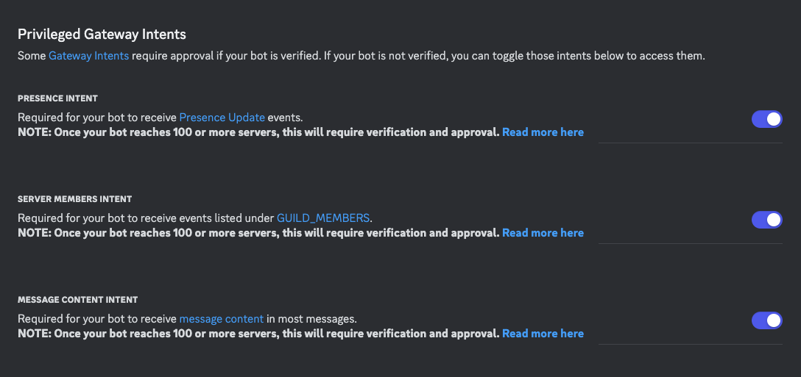
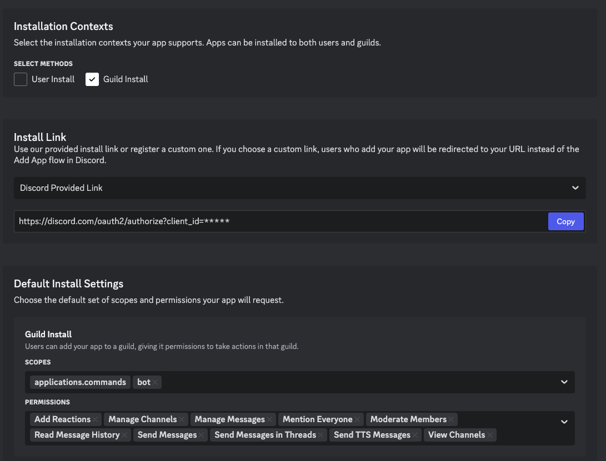

# Platforms setup

## Discord
This guide will walk you through the steps to set up a Discord bot using Python.

### Step 1: Create a Discord Application
1. Go to the [Discord Developer Portal](https://discord.com/developers/applications).
2. Click on "New Application".
3. Give your application a name and click "Create".
4. Navigate to the "Bot" tab on the left sidebar.
5. Turn on all intents.

6. Go to "Installation" tab on the left sidebar, and add permissions for the bot.

5. Copy the generated link and add the bot to your server.

### Step 2: Get Your Bot Token

1. Under the "Bot" tab, you will see a "Token" section.
2. Click "Copy" to copy your bot token. **Keep this token secure!**

## Slack
This guide will walk you through the steps to set up a Slack bot and enable a slash command.

### Step 1: Create a Slack App
1. Go to the [Slack API: Applications](https://api.slack.com/apps).
2. Click on "Create New App".
3. Choose "From scratch".
4. Give your app a name and select the workspace you want to develop your app in.
5. Click "Create App".

### Step 2: Create a Bot User
1. In your app's settings, navigate to the "OAuth & Permissions" tab.
2. Scroll down to the "Scopes" section.
3. Under "Bot Token Scopes", click "Add an OAuth Scope" and add the necessary scopes for your bot.
4. Navigate to the "App Home" tab and scroll down to the "Show Tabs" section.
5. Enable the "Messages Tab" to allow your bot to post messages.

### Step 3: Install Your App to Your Workspace
1. In your app's settings, navigate to the "OAuth & Permissions" tab.
2. Click "Install App to Workspace".
3. Review the permissions and click "Allow".
4. Copy the "Bot User OAuth Access Token" and "Signing Secret". **Keep these tokens secure!**

### Step 4: Enable Slash Command
1. In your app's settings, navigate to the "Slash Commands" tab.
2. Click "Create New Command".
3. Fill in the required fields:
    - Command: The supported commands are: `/help`, `/sub`, `/unsub`.
    - Request URL: `http://<server-ip>:<slack-port>/slack/events` same for all commands.
    - Short Description: A brief description of what your command does.
    - Usage Hint: Instructions on how to use your command.
4. Click "Save".
5. After the slash commands are setup, you can install the bot to your Slack workspace

## Telegram
This guide will walk you through the steps to set up a Telegram bot using Python.

### Step 1: Create a Telegram Bot
1. Open the Telegram app and search for the "BotFather" bot.
2. Start a chat with BotFather by clicking the "Start" button.
3. Use the command `/newbot` to create a new bot.
4. Follow the instructions to set a name and username for your bot.
5. After completing the setup, BotFather will provide you with a token. **Keep this token secure!**